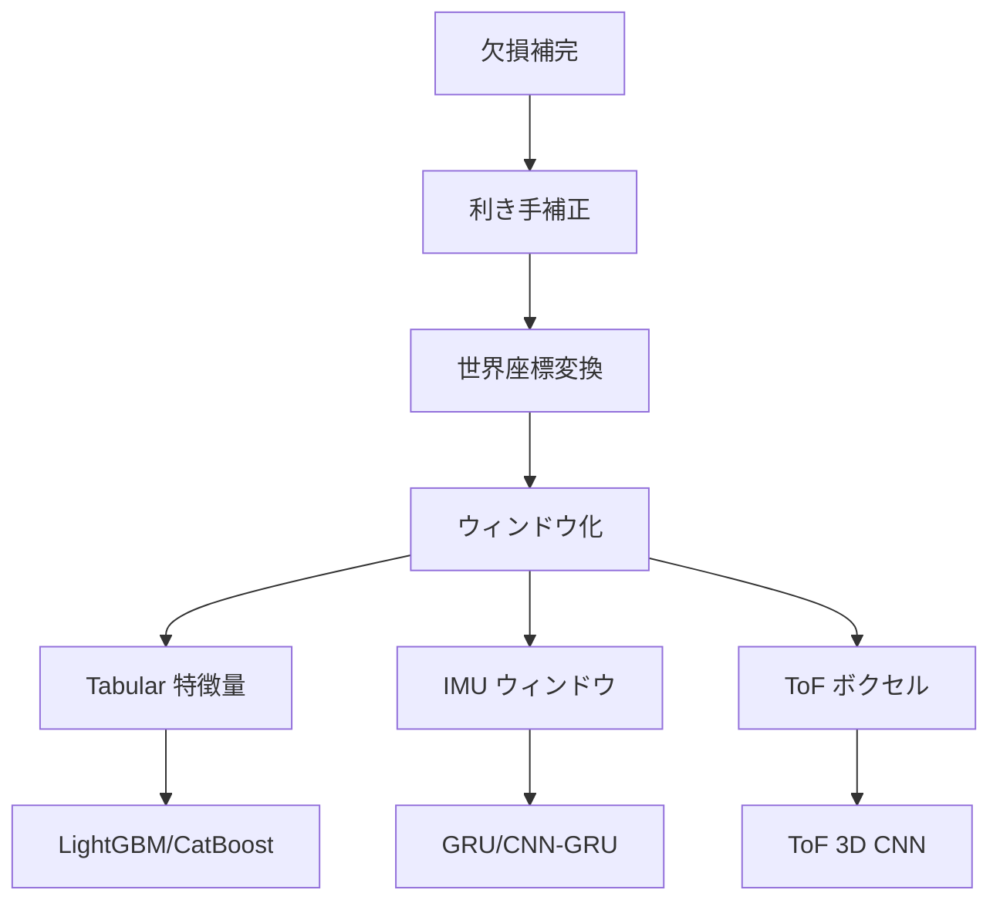

# 前処理スクリプト出力一覧

`scripts/run_preprocessing.py` を実行すると、`output/experiments/<experiment_name>/preprocessed/` 以下に複数の pickle ファイルが保存されます。各ファイルの内容と主な用途を整理します。

## 出力ファイル一覧

| ファイル名 | 内容 | 典型的な形状 | 主な用途 |
|------------|------|-------------|---------|
| `train_windows.pkl` / `test_windows.pkl` | ウィンドウ化された IMU センサテンソル | `(n_windows, 128, 12)` | GRU/CNN 系モデルの入力 |
| `train_demographics.pkl` / `test_demographics.pkl` | ウィンドウ単位の Demographics 特徴量 | `(n_windows, 7)` | 時系列モデルとの結合用 |
| `train_tabular.pkl` / `test_tabular.pkl` | Block A–H,M を統合した Tabular 特徴量 | `(n_windows, 120)` | LightGBM/CatBoost 用 |
| `train_tof_windows.pkl` / `test_tof_windows.pkl` (旧 `train_tof_voxel.pkl` / `test_tof_voxel.pkl`) | ToF ピクセルを (T, depth, H, W) へ整形したテンソル | `(time, 5, 8, 8)` | ToF 3D CNN 用 |
| `train_labels.pkl` / `test_labels.pkl` | 各ウィンドウのラベル ID | `(n_windows,)` | 教師データ |
| `train_info.pkl` / `test_info.pkl` | `sequence_id` や `start_idx` などのメタ情報 | - | 後続処理用 |
| `preprocessor.pkl` | 学習済み `Preprocessor` を `Preprocessor.save()` で保存したファイル | - | `Preprocessor.load()` で読み込み |

※ `--mode predict` で実行した場合は `predict_*.pkl` が生成されます。

## 共通前処理フロー

上図の A〜D が共通処理で、E 以降がモデル固有部に相当します。詳細な実装は [前処理パイプライン概要](preprocessing_pipeline.md) を参照してください。
